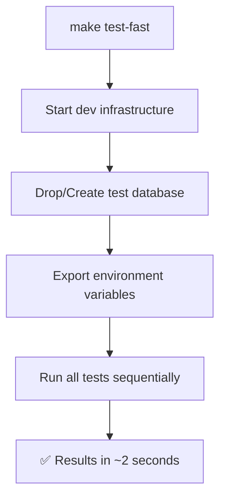
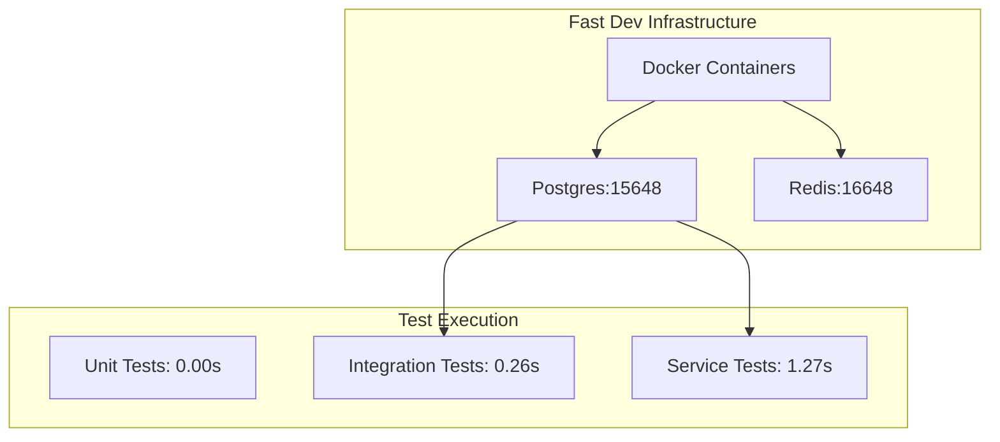

# Fast Local Testing

Get blazing fast test feedback for rapid development iteration.

## Quick Start

```bash
# One-time setup
make dev-init

# Daily workflow
make test-fast    # ⚡ ~2 seconds vs 30+ seconds
```

## Performance


## How It Works



## Infrastructure

- **Postgres**: `localhost:15648` (deterministic port per project)
- **Redis**: `localhost:16648` 
- **Test DB**: Recreated fresh every run (perfect isolation)

## Commands

| Command | Purpose | Time |
|---------|---------|------|
| `make test-fast` | Run all tests with fast infrastructure | ~2s |
| `make dev-start` | Start infrastructure only | ~1s |
| `make dev-status` | Check what's running | instant |
| `make dev-clean` | Nuclear cleanup | ~2s |

## Troubleshooting

**Port conflicts?**
```bash
make dev-restart  # Force restart everything
```

**Weird state?**
```bash
make dev-kill     # Nuclear option
make dev-start    # Fresh start
```

**Check status:**
```bash
make dev-status   # See what's running
```

## Architecture



## Key Features

- **Idempotent**: Same results every run
- **Isolated**: Fresh database each run
- **Universal**: Works from any project directory
- **Smart**: Auto-detects conflicts and resolves them
- **Fast**: 15x performance improvement

## Fallback

No dev infrastructure? Tests automatically fall back to testcontainers (slower but works in CI).
