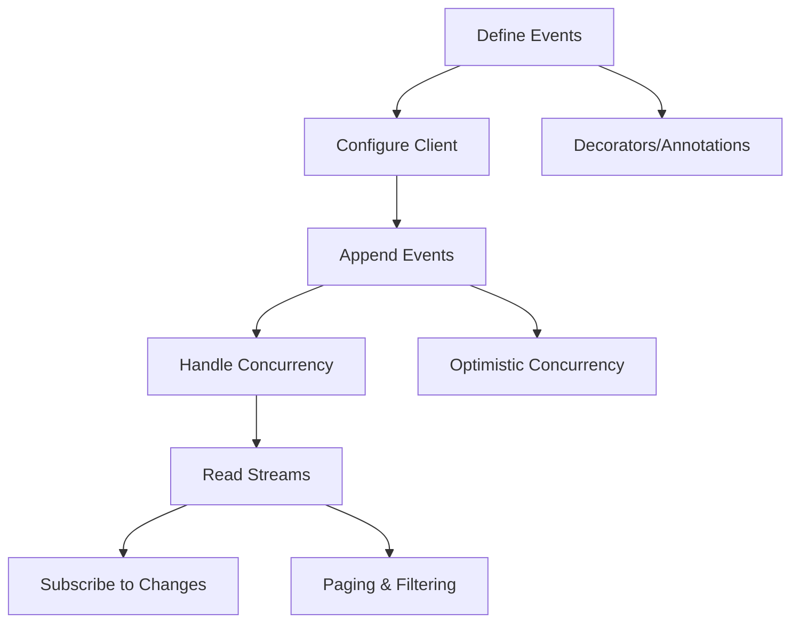

# Event Store SDKs Overview

The Event Store provides polyglot SDKs for seamless integration across different programming languages and frameworks. All SDKs follow the same architectural principles and provide consistent APIs.

## 🏗️ SDK Architecture

### Core Principles

1. **Polyglot Consistency**: Same API surface across all languages
2. **Client-Proposed Sequences**: SDKs handle optimistic concurrency automatically
3. **Type Safety**: Strong typing where possible, runtime validation where needed
4. **Decorator-Driven**: Event definition through decorators/annotations
5. **Async-First**: Built for high-performance, non-blocking operations

### Shared Components

- **Event Envelope**: Consistent event structure across all SDKs
- **Optimistic Concurrency**: Client-proposed nonce validation
- **Connection Management**: Efficient gRPC connection pooling
- **Error Handling**: Language-appropriate error types and handling
- **Serialization**: Protocol buffer-based event serialization

## 📦 Available SDKs

| Language | Status | Package | Features |
|----------|--------|---------|----------|
| **TypeScript** | ✅ Production | `@eventstore/sdk-ts` | Decorators, Type Safety, Async/Await |
| **Python** | 🚧 Development | `eventstore-sdk-py` | AsyncIO, Type Hints, Pydantic Models |
| **Rust** | ✅ Production | `eventstore-sdk-rs` | Zero-Copy, Async, Strong Typing |

## 🔄 SDK Workflow



## 🎯 Key Features

### Event Definition
```typescript
@Event(\{ type: 'com.myco.order.OrderCreated', revision: 1 \})
class OrderCreated {
  constructor(
    public readonly orderId: string,
    public readonly amount: number
  ) {}
}
```

### Client Usage
```typescript
const client = new EventStoreClient(\{
  endpoint: 'localhost:50051',
  credentials: \{ /* auth */ \}
\});

// Append with optimistic concurrency
await client.appendEvents(\{
  tenantId: 'tenant-123',
  aggregateId: 'order-123',
  aggregateType: 'Order',
  expectedAggregateNonce: 4,
  events: [new OrderCreated('order-123', 99.99)]
\});
```

### Stream Reading
```typescript
const stream = await client.readStream(\{
  aggregateId: 'order-123',
  fromAggregateNonce: 1,
  forward: true
\});
```

### Real-time Subscriptions
```typescript
const subscription = await client.subscribe(\{
  tenantId: 'tenant-123',
  aggregateIdPrefix: 'Order-',
  fromGlobalNonce: 0
\});

for await (const event of subscription) \{
  console.log('Received:', event);
\}
```

## 🛠️ SDK Development

### Code Generation
- **Protocol Buffers**: Shared `.proto` definitions
- **Language-Specific**: Generated client stubs for each language
- **Type Safety**: Strong typing from proto definitions

### Testing Strategy
- **Unit Tests**: SDK-specific functionality
- **Integration Tests**: End-to-end with event store
- **Concurrency Tests**: Race condition validation
- **Performance Tests**: Throughput and latency benchmarks

## 📚 SDK Documentation Structure

- **[SDK Overview](sdk-overview.md)** - This document
- **[TypeScript SDK](../typescript/typescript-sdk.md)** - Complete TypeScript implementation
- **[Python SDK](../python/python-sdk.md)** - Python async implementation
- **[Rust SDK](../rust/rust-sdk.md)** - Rust native implementation
- **[API Reference](../api-reference.md)** - Complete API documentation

## 🚀 Getting Started

Choose your language to get started:

- **TypeScript**: `npm install @eventstore/sdk-ts`
- **Python**: `pip install eventstore-sdk-py`
- **Rust**: `cargo add eventstore-sdk-rs`

See the language-specific guides for detailed setup and usage instructions.
