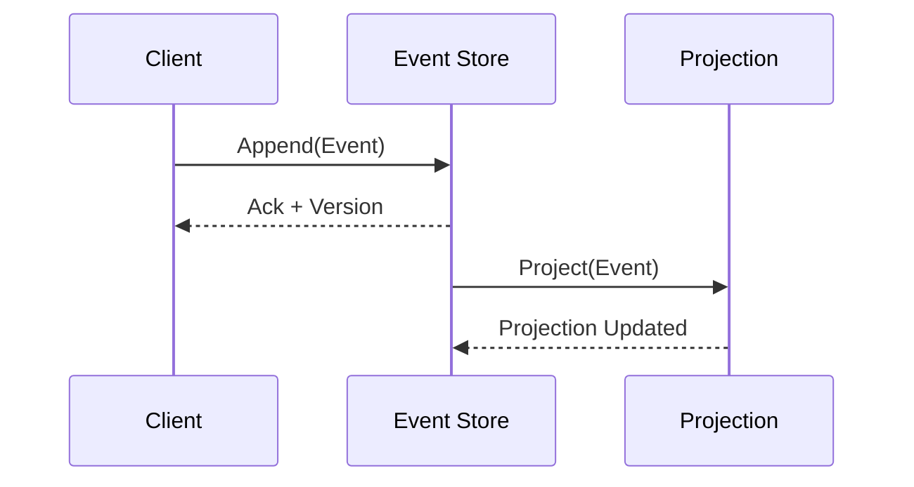

# Event Sourcing Platform

Welcome to the documentation hub.

- Concepts that explain how the event store and SDKs work.
- Development guides for running and contributing to the repository.
- Implementation details and ADRs for architectural decisions.

## Mermaid example

